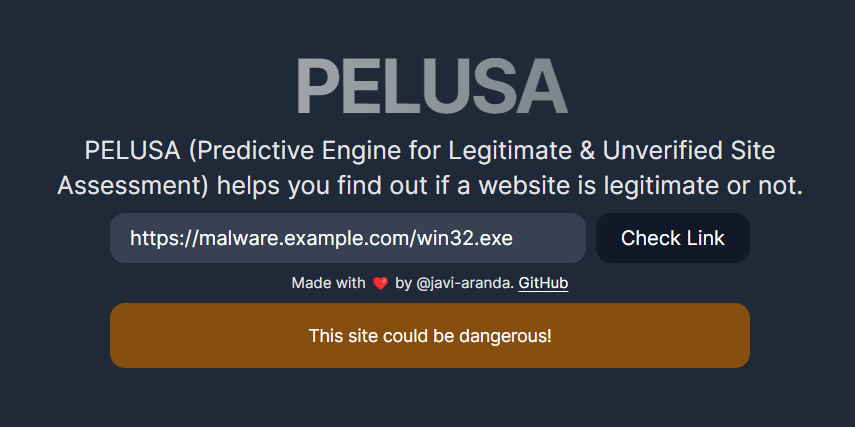

# Pelusa React




## What is Pelusa?

Pelusa React is a web application that allows you to interact with the Pelusa API to help you classify URLs as malicious or benign.

## Getting Started

First, install dependencies:

```bash
npm install
# or
yarn install
```

Run the development server:

```bash
npm run dev
# or
yarn dev
```

Or use Docker:

```bash
docker build -t pelusa-react .
docker run -p 3000:3000 pelusa-react
```

Open [http://localhost:3000](http://localhost:3000) in your favourite browser to access the application.

## Environment variables

The following environment variables are required to run the application, use a `.env.local` file to set them:

```bash
API_ENDPOINT=http://localhost:8000  # Modify as necessary
```
